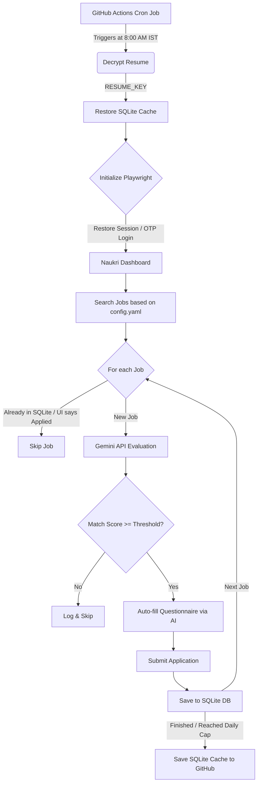

# 🤖 Naukri.com AI Job Application Agent

A production-grade, AI-powered agent that automatically discovers and applies to relevant jobs on Naukri.com based on your resume, preferences, and intelligent matching.

## ✨ Features

- **🧠 AI-Powered Matching** — Uses Google Gemini to analyze job descriptions against your resume and compute a match score (0-100) with detailed reasoning
- **🌐 Browser Automation** — Playwright-based automation with anti-detection stealth patches and human-like interaction patterns
- **📄 Smart Resume Parsing** — Extracts and structures your PDF resume into skills, experience, education, and achievements
- **💬 Auto Question Answering** — AI fills screening questionnaires (CTC, notice period, experience) during the apply flow
- **🛡️ Safety Controls** — Daily application caps, match score thresholds, exclusion filters, and dry-run mode
- **📊 Rich Dashboard** — Beautiful terminal output with progress indicators, match scores, and run statistics
- **💾 Persistent State** — SQLite database tracks all applied jobs, scores, and run history
- **🔐 Supervised Mode** — Visible browser with manual OTP handling for security

## 📋 Prerequisites

- Python 3.11 or higher
- Google Gemini API key ([Get one here](https://ai.google.dev/))
- A Naukri.com account
- Your resume as a PDF file

## 🚀 Quick Start

### 1. Install Dependencies

```bash
cd "AI Agent Naukri"
pip install -r requirements.txt
playwright install chromium

# Optional, for contributing / running lint+type checks locally:
pip install -r requirements-dev.txt
pre-commit install
```

### 2. Initialize Configuration

```bash
python -m src.naukri_agent.main init
```

This creates a `.env` file from the template. Edit it with your credentials:

```env
NAUKRI_EMAIL=your_email@example.com
NAUKRI_PASSWORD=your_password
GEMINI_API_KEY=your_gemini_api_key
```

### 3. Configure Job Preferences

Edit `config.yaml` to set:

- **Search keywords** — Job titles you're looking for
- **Locations** — Preferred cities or "Remote"
- **Experience range** — Min/max years
- **Profile details** — CTC, notice period (for auto-filling forms)
- **Application controls** — Daily cap, match threshold
- **Exclusions** — Companies or keywords to skip

### 4. Run the Agent

```bash
# Dry run first (scores jobs but doesn't apply)
python -m src.naukri_agent.main run --dry-run

# Full run (actually applies)
python -m src.naukri_agent.main run

# With overrides
python -m src.naukri_agent.main run --cap 10 --threshold 80
```

### 5. View Statistics

```bash
python -m src.naukri_agent.main status
```

## 🎯 CLI Commands

| Command | Description |
|---------|-------------|
| `python -m src.naukri_agent.main run` | Start the application agent |
| `python -m src.naukri_agent.main run --dry-run` | Score jobs without applying |
| `python -m src.naukri_agent.main status` | View application statistics |
| `python -m src.naukri_agent.main parse-resume <path>` | Test resume parsing |
| `python -m src.naukri_agent.main test-match <url>` | Test matching against a job |
| `python -m src.naukri_agent.main init` | Initialize config files |
| `python -m src.naukri_agent.main refresh-profile` | Refresh Naukri profile to keep it active |

## 🏗️ Architecture

### Flowise Application Logic

```mermaid
flowchart TD
    A[GitHub Actions Cron Job] -->|Triggers at 8:00 AM IST| B(Decrypt Resume)
    B -->|RESUME_KEY| C[Restore SQLite Cache]
    C --> D{Initialize Playwright}
    D -->|Restore Session / OTP Login| E[Naukri Dashboard]
    E --> F[Search Jobs based on config.yaml]
    F --> G{For each Job}
    G -->|Already in SQLite / UI says Applied| H[Skip Job]
    G -->|New Job| I[Gemini API Evaluation]
    I --> J{Match Score >= Threshold?}
    J -->|No| K[Log & Skip]
    J -->|Yes| L[Auto-fill Questionnaire via AI]
    L --> M[Submit Application]
    M --> N[Save to SQLite DB]
    N -->|Next Job| G
    N -->|Finished / Reached Daily Cap| O[Save SQLite Cache to GitHub]
```

### Code Structure
```text
src/naukri_agent/
├── config/          # Settings, constants, selectors
├── ai/              # Gemini-powered resume parsing, job matching, Q&A
├── browser/         # Playwright engine, stealth, login, search, apply
├── database/        # SQLite models and repository (Cached in Cloud)
├── orchestrator/    # Main agent loop connecting UI and AI
├── utils/           # Logger, helpers
└── main.py          # CLI entry point
```

## ⚙️ Configuration Reference

See `config.yaml` for the full list of configurable options. Key settings:

| Setting | Default | Description |
|---------|---------|-------------|
| `application.daily_cap` | 25 | Max applications per day |
| `application.match_score_threshold` | 70 | Minimum score to auto-apply |
| `application.delay_between_applies_min` | 30s | Min delay between apps |
| `application.delay_between_applies_max` | 90s | Max delay between apps |
| `application.skip_external_apply` | true | Skip external redirects |
| `search.max_pages` | 3 | Pages to scan per keyword |
| `search.freshness` | 7 | Job age in days |

## 🛡️ Safety & Ethics

- **Supervised use only** — The browser is visible; you must be present for OTP
- **Rate limited** — Configurable delays prevent rapid-fire applications
- **Daily caps** — Hard limit on applications per day
- **Dry-run mode** — Test everything without actually applying
- **Terms of Service** — This automates account actions on Naukri.com using
  anti-bot-detection patches, which very likely violates Naukri's Terms of
  Service and carries real account-ban risk. Read **[SECURITY.md](SECURITY.md)**
  before running this against a real account.

## 🧪 Development & Testing

```bash
# Run the test suite
pytest

# Run with coverage
pytest --cov=src --cov-report=term-missing

# Lint
ruff check .

# Format
black .

# Type-check
mypy src/
```

CI (`.github/workflows/ci.yml`) runs all of the above on every push/PR.
`.pre-commit-config.yaml` runs ruff + black automatically before each commit
once you've run `pre-commit install`.

## 📂 Data Storage

All data is stored locally in the `data/` directory:

- `data/naukri_agent.db` — SQLite database with all jobs, applications, and stats
- `data/sessions/` — Browser session state for login persistence
- `data/logs/` — Daily log files

## ☁️ Cloud Deployment (GitHub Actions)

This project is fully configured to run automatically and completely for free using **GitHub Actions**. 

To protect your privacy, your `resume.pdf` is strictly ignored by Git. Instead, we use military-grade AES encryption to securely upload it, allowing the cloud bot to decrypt it on the fly.

### 1. Encrypt Your Resume
Before deploying to the cloud, you must securely encrypt your resume so GitHub Actions can read it.
1. Place your `resume.pdf` in the root folder of this project.
2. Run the encryption helper script:
   ```bash
   python scripts/update_resume.py
   ```
3. This will create a `resume.pdf.enc` file (which is safe to push to GitHub) and a `resume_key.txt` file (which contains your secret decryption key).

### 2. Configure GitHub Secrets
1. Navigate to your repository on GitHub.
2. Go to **Settings** > **Secrets and variables** > **Actions**.
3. Click **New repository secret** and add the following 4 secrets:
   - `GEMINI_API_KEY`: Your Google Gemini API key.
   - `NAUKRI_EMAIL`: Your Naukri account email.
   - `NAUKRI_PASSWORD`: Your Naukri password.
   - `RESUME_KEY`: The exact string found inside your local `resume_key.txt` file.

### 3. Execution & Memory
By default, the GitHub Actions workflow (`.github/workflows/auto-apply.yml`) is scheduled to run daily at `8:00 AM IST` (`30 2 * * *` UTC).

**🧠 Persistent Memory:** The bot uses a local SQLite database (`data/`) to track which jobs it has already applied to. To ensure this memory survives between ephemeral cloud runs, the workflow automatically uses **GitHub Actions Cache** to save and restore the database daily.

## 📄 Updating Your Resume or Session

Because your session cookies and resume are securely encrypted, you do **not** need to touch GitHub Secrets again when updating them!

### To Update Your Resume:
1. Replace the local `resume.pdf` file with your updated version.
2. Run the update script:
   ```bash
   python scripts/update_resume.py
   ```
3. Commit and push the updated `resume.pdf.enc` file.

### To Bypass Naukri OTP / Cloud Login Issues:
If Naukri is asking for an OTP on your cloud bot or login is failing, you can bypass the login screen entirely by grabbing the session cookies from your own laptop:
1. Run the bot locally so it opens a visible window:
   ```bash
   python -m src.naukri_agent.main run --dry-run
   ```
2. Log into Naukri manually. Once the bot starts scanning jobs, you can press `Ctrl+C` to stop it.
3. Your login cookies are now saved locally. Encrypt them for the cloud:
   ```bash
   python scripts/sync_session.py
   ```
4. Commit and push the new `session.enc` file:
   ```bash
   git add session.enc
   git commit -m "Sync Naukri session to cloud"
   git push
   ```
The cloud bot will now automatically inherit your login session and skip the login page entirely!

> [!NOTE]
> **🔄 Automatic Keep-Alive:** The GitHub Action workflow is configured to automatically re-encrypt and push updated session cookies (`session.enc`) back to your repository at the end of every run. This means the session will stay alive and refresh itself indefinitely. You only need to run the manual `sync_session.py` command as a fallback if the session is ever forced to log out by Naukri.

## 🔧 Troubleshooting

| Issue | Solution |
|-------|----------|
| Login fails | Check credentials in `.env`, ensure no CAPTCHA |
| OTP timeout | Enter OTP faster in the browser window (120s limit) |
| Apply button not found | Naukri may have updated their UI; update selectors in `constants.py` |
| Low match scores | Adjust `match_score_threshold` or refine resume |
| Bot detected | Increase delays, reduce daily cap, use a VPN |

## 🛡️ Production Hardening & Deployment

The platform is built as a set of 12-factor, stateless microservices behind a single
API gateway. The following hardening is already in place:

### Architecture
- **API gateway** verifies JWTs locally (no extra network hop) and enforces
  per-IP rate limiting, request-size limits, and request-ID correlation.
- **Per-service auth** — the gateway proves itself to backends with a shared
  `SERVICE_TOKEN` (`X-Service-Token`); direct access to a backend port without
  it is rejected when the token is configured.
- **Resilience** — every cross-service HTTP call uses a pooled client, retries
  with exponential backoff, and a per-upstream **circuit breaker**. If a backend
  is down the gateway fails fast with `502/503` instead of hanging.
- **Agent safety** — at most one run per platform (concurrency gate), cross-platform
  process kill (incl. Windows `taskkill /T`), a supervisor that recovers stuck runs,
  and crashed runs are recorded as `error` (not `completed`).
- **Data layer** — idempotent application writes (no duplicate blocking rows),
  transient-failure retries, and a DB-aware `/api/health` + `/api/ready` + `/api/live`.

### Required environment variables (production)
| Variable | Purpose |
|----------|---------|
| `JWT_SECRET` | HS256 signing secret for user JWTs. **Required in prod** — the gateway fails fast on boot if missing. Use the same value for every service. |
| `SERVICE_TOKEN` (or `DASHBOARD_API_KEY`) | Shared gateway↔service token. Set identically on gateway + backends. |
| `SESSION_ENCRYPTION_KEY` | Fernet key for encrypting stored Naukri credentials at rest. |
| `POSTGRES_*` / `DATABASE_URL` | Database connection (pool size/env tunable). |
| `CORS_ORIGINS` | Comma-separated allowed browser origins. |
| `OPEN_REGISTRATION` | `false` (default) disables public self-registration. |
| `PROD` | `true` enables the `JWT_SECRET` fail-fast check. |

### Secrets at rest
- Naukri credentials in `config.yaml` are stored as `enc:<fernet-token>` (transparently
  decrypted at load). The plain `config.yaml` is **git-ignored**; commit
  `config.yaml.example` as a template instead.
- **The plaintext password that previously existed in git history has been scrubbed**
  from the `main` / `hotfix/*` / `feature/*` / `release/*` branches via `git filter-repo`.
  Ensure `JWT_SECRET`, `SERVICE_TOKEN`, and `SESSION_ENCRYPTION_KEY` are provided via
  your secrets manager / CI, never committed.

### Observability
- Every service and the gateway expose Prometheus metrics on `GET /metrics`
  (`http_requests_total`, `http_request_duration_seconds`, `http_requests_in_flight`).
  Scrape these for SLOs and alerting. The gateway also exposes `GET /api/health`
  which probes each backend.

### Local run vs container
- `python scripts/run_services.py` boots all services on a local SQLite DB (handy for
  dev). `docker-compose.yml` provides a production-shaped deployment with secrets via
  env, healthchecks, resource limits, and `edge`/`backend` network segmentation.

## 📈 Monitoring & Alerting

Every service and the gateway expose Prometheus metrics on `GET /metrics`
(`http_requests_total`, `http_request_duration_seconds`, `http_requests_in_flight`,
plus the gateway `http_server_errors_total` / `gateway_circuit_breaker_open` and the
agent `agent_running` / `agent_last_run_timestamp_seconds` / `agent_last_apply_timestamp_seconds`
/ `agent_blocked`). Scrape them with Prometheus (`monitoring/prometheus.example.yml`)
and load `monitoring/alerts.yaml` as rule files.

**The two alerts that matter most for a client engagement** (the dead-man's-switch):
- `AgentStalled` — no agent run in 6h → the bot may have silently died.
- `NoApplicationsLately` — no successful application in 24h → investigate Naukri blockers.
- `AgentExternallyBlocked` — Naukri threw a captcha/OTP/IP-ban; a human must resolve it
  and restart the run (the agent pauses automatically instead of hammering the site).

Kubernetes: manifests are not included in this tree (deploy via Docker Compose for
now). The gateway and stateless backends are safe to run multi-replica behind a
load balancer; keep the `agent` service at a single replica because its single-run
gate is in-process. The one remaining single point of failure to plan for is the
database — use a managed Postgres with a standby for HA.

## 📜 License

This project is for personal, educational use only. Use responsibly.
